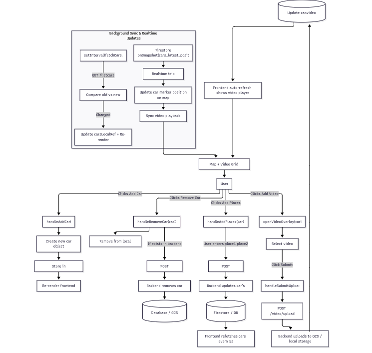

# 🗺️ MapWithAdmin — Real-Time Car Fleet Dashboard

MapWithAdmin is a React component that provides an admin interface to manage and monitor a fleet of simulated or real vehicles.
It integrates with Firebase (Firestore + Auth), Google Maps, and a custom backend API for car data, routes, and video uploads.

The system supports:

Real-time tracking of cars on Google Maps

Adding/removing cars dynamically

Assigning travel waypoints

Uploading video files for each car

Synchronized video playback with GPS positions


## ⚙️ Main Technologies
Technology	Purpose
React + Vite	Frontend framework and build tool
Firebase Firestore	Real-time data for car positions
Firebase Auth	Anonymous authentication for users
Google Maps JS API	Real-time visualization of car locations
Backend REST API	Managing cars, waypoints, and videos
CSS Grid + Overlays	Responsive admin UI

# 🚗 Functional Overview

## 1. Google Maps Setup

The component uses @react-google-maps/api to load and render a map:

```bash
const { isLoaded } = useJsApiLoader({
  googleMapsApiKey: import.meta.env.VITE_GOOGLE_MAPS_API_KEY,
  libraries: ["geometry", "marker"],
});
```

Once loaded, the map displays car markers (car.png) using AdvancedMarkerElement for custom rotation.

## 2. Anonymous Firebase Authentication

On component mount:

signInAnonymously(auth);
onAuthStateChanged(auth, (user) => { ... });


This ensures the admin dashboard can access Firestore data securely without manual sign-in.

## 3. Fetching Cars from Backend

A 5-second polling interval retrieves the list of cars and compares it to the local cache:

const res = await fetch(`${API_URL}/listcars`);


If differences are detected (new cars, updated waypoints, or videos), the dashboard re-renders.

Each car object:

```bash
{
  "id": "car1",
  "places": ["Jakarta", "Bandung"],
  "video": "car1.m4v"
}
```

## 4. Real-Time Car Tracking

The component listens to Firestore collections:

cars_latest_position — contains latest trip IDs

Each subcollection /positions — stores lat/lng and timestamp updates

When a new trip is detected:

```bash
onSnapshot(query(positionsRef, orderBy("timestamp", "desc"), limit(1)), ...)
```

This updates the car’s position marker on the map and synchronizes video playback time based on timestamps.

Sync logic example:

```bash
const elapsed = (newestTs - startTs) / 1000;
videoEl.currentTime = elapsed % videoEl.duration;
```

## 5. Video Synchronization

Each car has an associated <video> element displaying its journey ad video.
The playback time is automatically synced with real-time GPS data to ensure accurate visual representation.

```bash
<VideoPlayer carId={car.id} src={`${API_URL}/stream/${car.video}`} />
```

## 6. Car Management Functions
➕ Add Car

Creates a new car ID locally:

```bash
car1, car2, ...
```

Adds it to a temporary list until confirmed by the backend.

➖ Remove Car

Calls backend endpoint:

```bash
POST /removecar
{
  "carId": "car2"
}
```

Removes the car from Firestore and the dashboard.

### 📍 Add Places

Allows admin to define waypoints for a car using text input:

"Jakarta" "Bogor" "Bandung"


Backend route:

POST /addplaces
```bash
{
  "carId": "car1",
  "places": ["Jakarta", "Bogor", "Bandung"]
}
```

### 🎥 Add Video

Admins can upload a .m4v file for each car:

POST /video/upload

```bash
FormData: { carId, video }
```

After upload, the video will appear alongside the map view in the grid.



