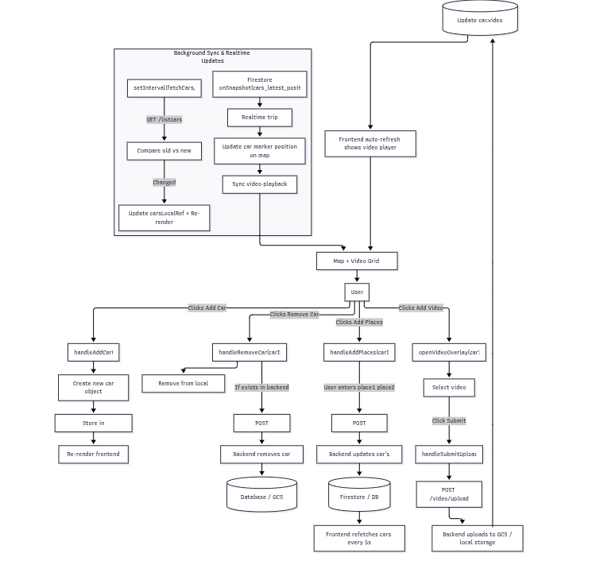

# 🗺️ MapWithAdmin — Real-Time Car Fleet Dashboard

MapWithAdmin is a React component that provides an admin interface to manage and monitor a fleet of simulated or real vehicles.
It integrates with Firebase (Firestore + Auth), Google Maps, and a custom backend API for car data, routes, and video uploads.

The system supports:

Real-time tracking of cars on Google Maps

Adding/removing cars dynamically

Assigning travel waypoints

Uploading video files for each car

Synchronized video playback with GPS positions


## ⚙️ Main Technologies
Technology	Purpose
React + Vite	Frontend framework and build tool
Firebase Firestore	Real-time data for car positions
Firebase Auth	Anonymous authentication for users
Google Maps JS API	Real-time visualization of car locations
Backend REST API	Managing cars, waypoints, and videos
CSS Grid + Overlays	Responsive admin UI

# 🚗 Functional Overview

## 1. Google Maps Setup

The component uses @react-google-maps/api to load and render a map:

```bash
const { isLoaded } = useJsApiLoader({
  googleMapsApiKey: import.meta.env.VITE_GOOGLE_MAPS_API_KEY,
  libraries: ["geometry", "marker"],
});
```

Once loaded, the map displays car markers (car.png) using AdvancedMarkerElement for custom rotation.

## 2. Anonymous Firebase Authentication

On component mount:

signInAnonymously(auth);
onAuthStateChanged(auth, (user) => { ... });


This ensures the admin dashboard can access Firestore data securely without manual sign-in.

## 3. Fetching Cars from Backend

A 5-second polling interval retrieves the list of cars and compares it to the local cache:

const res = await fetch(`${API_URL}/listcars`);


If differences are detected (new cars, updated waypoints, or videos), the dashboard re-renders.

Each car object:

```bash
{
  "id": "car1",
  "places": ["Jakarta", "Bandung"],
  "video": "car1.m4v"
}
```

## 4. Real-Time Car Tracking

The component listens to Firestore collections:

cars_latest_position — contains latest trip IDs

Each subcollection /positions — stores lat/lng and timestamp updates

When a new trip is detected:

```bash
onSnapshot(query(positionsRef, orderBy("timestamp", "desc"), limit(1)), ...)
```

This updates the car’s position marker on the map and synchronizes video playback time based on timestamps.

Sync logic example:

```bash
const elapsed = (newestTs - startTs) / 1000;
videoEl.currentTime = elapsed % videoEl.duration;
```

## 5. Video Synchronization

Each car has an associated <video> element displaying its journey ad video.
The playback time is automatically synced with real-time GPS data to ensure accurate visual representation.

```bash
<VideoPlayer carId={car.id} src={`${API_URL}/stream/${car.video}`} />
```

## 6. Car Management Functions
➕ Add Car

Creates a new car ID locally:

```bash
car1, car2, ...
```

Adds it to a temporary list until confirmed by the backend.

➖ Remove Car

Calls backend endpoint:

```bash
POST /removecar
{
  "carId": "car2"
}
```

Removes the car from Firestore and the dashboard.

### 📍 Add Places

Allows admin to define waypoints for a car using text input:

"Jakarta" "Bogor" "Bandung"


Backend route:

POST /addplaces
```bash
{
  "carId": "car1",
  "places": ["Jakarta", "Bogor", "Bandung"]
}
```

### 🎥 Add Video

Admins can upload a .m4v file for each car:

POST /video/upload

```bash
FormData: { carId, video }
```

After upload, the video will appear alongside the map view in the grid.




### Data test for Car1

"Domestic Car Terminal, WW27+23C, Kali Baru, Jakarta 14110, Indonesia",
"Bakso Bang Aep, Jl. F Raya No.7 1, Rawabadak Utara, Jakarta 14230, Indonesia",
"Restoran Sederhana Tj. Priok, Jl. Sulawesi No.9, Koja, Jakarta 14350, Indonesia",
"Sindang Market, Jl. Sindang No.30, Koja, Jakarta 14220, Indonesia",
"Bebek Goreng H. Slamet (Asli) Tanjung Priok, Jl. Kebon Bawang VII No.26, Jakarta 14320,
Indonesia",
"Z Coffee Tanjung Priok, Jl. Bakti No.1A, Jakarta 14320, Indonesia",
"Ros Kebab dan Sosis, Tj. Priok, Jl. Warakas V Gg. 2 No.88, Jakarta 14340, Indonesia",
"Dapoer Ekyu (Jajanan Tradisional), Jl. Sungai Bambu No.8, Jakarta 14330, Indonesia",
"Restoran Rempah Nyonya, Jl. Danau Sunter Utara No.41, Jakarta 14340, Indonesia",
"Narasi Coffee & Eatery, Jl. Danau Agung 2 No.28, Jakarta 14350, Indonesia",
"Maple Park Apartment, Jl. HBR Motik No.2, Jakarta 14350, Indonesia",
"Sate Kemayoran, Rumah Susun Konver Blok 2B No.104, Kemayoran, Jakarta 10620, Indonesia",
"Ketoprak Kalibaru Timur III, Jl. Kali Baru Timur III, Jakarta 10460, Indonesia",
"Bakso Shemok, Jl. Cempaka Sari I No.26, Jakarta 10640, Indonesia",
"d'Arcici Hotel Cempaka Putih, Jl. Letjen Suprapto No.62, Jakarta 10520, Indonesia",
"Lippo Mall East Side (LMES), Jl. Letjen Suprapto Kav.60 No.1, Jakarta 10510, Indonesia",
"Seblak bang unay, Jl. Gading II No.2, Jakarta 14240, Indonesia",
"Nasi Uduk Teteh Ati, Jl. Raya Bekasi No.16, Jakarta 14250, Indonesia"

### Data test for Car2

"Cilandak Town Square Jl. TB Simatupang No.17, West Cilandak Cilandak, South Jakarta City, Jakarta
12430, Indonesia",
"Aston Priority Simatupang Hotel & Conference Center Jl. Let. Jend Jl. TB Simatupang No.Kav. 9,
Kebagusan Pasar Minggu South Jakarta City, Jakarta 12520, Indonesia",
"McDonald's Cipayung Jl. Cipayung Raya, Cipayung East Jakarta City, Jakarta 13840 Indonesia",
"Mal Ciputra Cibubur Jl. Alternatif Cibubur No.KM RT.005/RW.04, Jatikarya Jatisampurna Bekasi,
West Java 17435, Indonesia",
"Setu Market Jl. WR. Supratman Telajung Setu Bekasi Regency, West Java 17320, Indonesia",
"Primaya Hospital Bekasi Timur Jl. HM. Joyo Martono No.47 RT.003/RW.021, Margahayu Kec.
Bekasi Tim. Kota Bks, Jawa Barat 17113, Indonesia",
"McDonald's Duren Sawit Jl. Radin Inten II Duren Sawit Durensawit East Jakarta City, Jakarta 13440,
Indonesia",
"Layar Seafood Dan Ikan Bakar Sedayu City Kelapa Gading RT.8/RW.5, Rawa Terate Cakung East
Jakarta City, Jakarta 13920",
"Kandang Ingkung Resto & Kopi Jogja Cabang MGC Bekasi Jl. Mutiara Gading City Kedungjaya
Babelan Bekasi Regency, West Java 14560, Indonesia"

### Data test for Car3

"Citra Garden City 6 Citra 6, Blok M.2, Citragarden City Prepedan Kalideres RT.2/RW.5, Tegal Alur
Kec. Kalideres Kota Jakarta Barat, Daerah Khusus Ibukota Jakarta 11820, Indonesia",
"FM7 Resort Hotel Jakarta Airport Jl. Perancis No.67 Benda Tangerang City, Banten 15125 Indonesia",
"Mie Gacoan Jakarta - Peta Utara VP93+47M Jl. Satu Maret RT.9/RW.3, Pegadungan Kalideres, West
Jakarta City, Jakarta, Indonesia",
"Duta Garden Sport Center Jl. Husein Sastranegara No.109 RT.008/RW.008, Jurumudi Kec. Benda
Kota Tangerang, Banten 15124, Indonesia",
"Green Sedayu Biz Park Green Sedayu Bizpark Jl Raya Daan Mogot km 18 blok dm1 no 9
RT.11/RW.6, Kalideres Kec. Kalideres Kota Jakarta Barat, Daerah Khusus Ibukota Jakarta 11840,
Indonesia",
"Raaga Family Reflexology Jl. Plaza De Lumina Raya No.8 Blok B Duri Kosambi Kecamatan
Cengkareng Kota Jakarta Barat, Daerah Khusus Ibukota Jakarta 11750, Indonesia",
"Puri Indah Mall Jl. Puri Agung No.1 South Kembangan Kembangan West Jakarta City, Jakarta 11610,
Indonesia",
"McDonald's Joglo Jl. Joglo Raya RT.4/RW.3, Joglo Kec. Kembangan Kota Jakarta Barat, Daerah
Khusus Ibukota Jakarta 11640, Indonesia",
"Rumah Sakit Dr. Suyoto Jl. RC. Veteran Raya No.178 RT.9/RW.3, Bintaro Pesanggrahan South
Jakarta City, Jakarta 12330, Indonesia",
"Swiss-Belhotel Pondok Indah, Jakarta Jl. Duta Niaga Raya Pd. Pinang Kec. Kebayoran Lama Kota
Jakarta Selatan, Daerah Khusus Ibukota Jakarta 12310, Indonesia",
"Pasar Rebo Regional General Hospital Jl. TB Simatupang No.30 RT.9/RW.2, Gedong Pasar Rebo East
Jakarta City, Jakarta 13760, Indonesia"

### Dockerfile

FROM ghcr.io/hendram/frontendcar:latest

WORKDIR /home/frontendcar

ENV PORT=9001

EXPOSE 9001

CMD ["/bin/bash", "-c", "npm install && npm run dev"]

